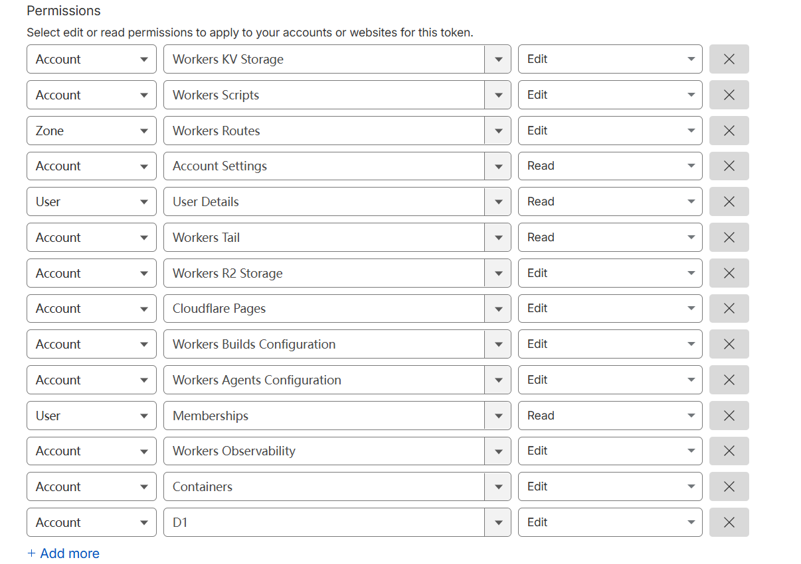

<p align="center">
  
  <h1 align="center">ZQ-Mail</h1>
</p>


## 特性

- 🔒 **隐私保护**：保护您的真实邮箱地址，远离垃圾邮件和不必要的订阅
- ⚡ **实时收件**：自动轮询，即时接收邮件通知
- ⏱️ **灵活有效期**：支持 1 小时、24 小时、3 天或永久有效
- 🎨 **主题切换**：支持亮色和暗色模式
- 📱 **响应式设计**：完美适配桌面和移动设备
- 🔄 **自动清理**：自动清理过期的邮箱和邮件
- 📱 **PWA 支持**：支持 PWA 安装
- 💸 **免费自部署**：基于 Cloudflare 构建, 可实现免费自部署，无需任何费用
- 🎉 **可爱的 UI**：简洁可爱萌萌哒 UI 界面
- 🔔 **Webhook 通知**：支持通过 webhook 接收新邮件通知
- 🛡️ **权限系统**：支持基于角色的权限控制系统
- 🔑 **OpenAPI**：支持通过 API Key 访问 OpenAPI

### Github Actions 部署

本项目可使用 GitHub Actions 实现自动化部署。支持以下触发方式：

1. **自动触发**：推送新的 tag 时自动触发部署流程
2. **手动触发**：在 GitHub Actions 页面手动触发

#### 部署步骤

##### 1. 绑定变量

本项目使用以下环境变量：

###### 认证相关(cloudflare绑定这些变量)
- `AUTH_GITHUB_ID`: GitHub OAuth App ID
- `AUTH_GITHUB_SECRET`: GitHub OAuth App Secret
- `AUTH_SECRET`: NextAuth Secret，用来加密 session，请设置一个随机字符串

###### Cloudflare 配置(github绑定这些变量)
- `CLOUDFLARE_API_TOKEN`: Cloudflare API Token
  
- `CLOUDFLARE_ACCOUNT_ID`: Cloudflare Account ID
- `DATABASE_NAME`: D1 数据库名称
- `DATABASE_ID`: D1 数据库 ID (可选, 如果不填, 则会自动通过 Cloudflare API 获取)
- `KV_NAMESPACE_NAME`: Cloudflare KV namespace 名称，用于存储网站配置
- `KV_NAMESPACE_ID`: Cloudflare KV namespace ID，用于存储网站配置 （可选， 如果不填, 则会自动通过 Cloudflare API 获取）
- `CUSTOM_DOMAIN`: 网站自定义域名, 如：your-domain.com (可选， 如果不填, 则会使用 Cloudflare Pages 默认域名)
- `PROJECT_NAME`: Pages 项目名 （可选，如果不填，则为 moemail） 

###### github OAuth App 配置

- 登录 [Github Developer](https://github.com/settings/developers) 创建一个新的 OAuth App
- 生成一个新的 `Client ID` 和 `Client Secret`
- 设置 `Application name` 为 `<your-app-name>`
- 设置 `Homepage URL` 为 `https://<your-domain>`
- 设置 `Authorization callback URL` 为 `https://<your-domain>/api/auth/callback/github`


##### 2. 选择触发方式：

   **方式一：推送 tag 触发**
   ```bash
   # 创建新的 tag
   git tag v1.0.0
   
   # 推送 tag 到远程仓库
   git push origin v1.0.0
   ```

   **方式二：手动触发**
   - 进入仓库的 Actions 页面
   - 选择 "Deploy" workflow
   - 点击 "Run workflow"

3. 部署进度可以在仓库的 Actions 标签页查看


## 邮箱域名配置

在个人中心页面，可以配置网站的邮箱域名，支持多域名配置。

### 邮箱后缀管理

**皇帝**角色可以在个人中心页面管理所有邮箱后缀：

1. 进入个人中心页面
2. 在"邮箱域名管理"部分：
   - 输入新的域名（如：`example.com`、`zoumail.dpdns.org`、`z-q.ip-ddns.org`）
   - 点击"添加"按钮
   - 可以查看当前配置的所有域名
   - 点击删除按钮可以移除不需要的域名
3. 保存设置后，新域名将立即生效

### 创建邮箱时的后缀选择

用户在创建新邮箱时，可以从管理员在配置面板中添加的所有后缀中选择。

**注意**：所有邮箱后缀都需要在配置面板中配置，包括之前固定的 `zoumail.dpdns.org` 和 `z-q.ip-ddns.org` 后缀。系统不再提供默认的域名。


### Cloudflare 邮件路由配置

为了使邮箱域名生效，还需要在 Cloudflare 控制台配置邮件路由，将收到的邮件转发给 Email Worker 处理。

1. 登录 [Cloudflare 控制台](https://dash.cloudflare.com/)
2. 选择您的域名
3. 点击左侧菜单的 "电子邮件" -> "电子邮件路由"
4. 如果显示 "电子邮件路由当前被禁用，没有在路由电子邮件"，请点击 "启用电子邮件路由"

5. 点击后，会提示你添加电子邮件路由 DNS 记录，点击 "添加记录并启用" 即可

6. 配置路由规则：
   - Catch-all 地址: 启用 "Catch-all"
   - 编辑 Catch-all 地址
    - 操作: 选择 "发送到 Worker"
    - 目标位置: 选择刚刚部署的 "email-receiver-worker"
    - 保存
  

### 注意事项
- 确保域名的 DNS 托管在 Cloudflare
- Email Worker 必须已经部署成功
- 如果 Catch-All 状态不可用(一直 loading)，请点击`路由规则`旁边的`目标地址`, 进去绑定一个邮箱

## 权限系统

本项目采用基于角色的权限控制系统（RBAC）。

### 角色配置

新用户默认角色由皇帝在个人中心的网站设置中配置：
- 公爵：新用户将获得临时邮箱、Webhook 配置权限以及 API Key 管理权限
- 骑士：新用户将获得临时邮箱和 Webhook 配置权限
- 平民：新用户无任何权限，需要等待皇帝册封为骑士或公爵

### 角色等级

系统包含四个角色等级：

1. **皇帝（Emperor）**
   - 网站所有者
   - 拥有所有权限
   - 每个站点只能有一个皇帝

2. **公爵（Duke）**  
   - 超级用户
   - 可以使用临时邮箱功能
   - 可以配置 Webhook
   - 可以使用创建 API Key 调用 OpenAPI
   - 可以被皇帝贬为骑士或平民

3. **骑士（Knight）**
   - 高级用户
   - 可以使用临时邮箱功能
   - 可以配置 Webhook
   - 可以被皇帝贬为平民或册封为公爵

3. **平民（Civilian）**
   - 普通用户
   - 无任何权限
   - 可以被皇帝册封为骑士或者公爵

### 角色升级

1. **成为皇帝**
   - 第一个访问 `/api/roles/init-emperor` 接口的用户将成为皇帝，即网站所有者
   - 站点已有皇帝后，无法再提升其他用户为皇帝

2. **角色变更**
   - 皇帝可以在个人中心页面将其他用户设为公爵、骑士或平民

### 权限说明

- **邮箱管理**：创建和管理临时邮箱
- **Webhook 管理**：配置邮件通知的 Webhook
- **API Key 管理**：创建和管理 API 访问密钥
- **用户管理**：升降用户角色
- **系统设置**：管理系统全局设置

## 系统设置

系统设置存储在 Cloudflare KV 中，包括以下内容：

- `DEFAULT_ROLE`: 新注册用户默认角色，可选值为 `CIVILIAN`、`KNIGHT`、`DUKE`
- `EMAIL_DOMAINS`: 支持的邮箱域名，多个域名用逗号分隔
- `ADMIN_CONTACT`: 管理员联系方式
- `MAX_EMAILS`: 每个用户可创建的最大邮箱数量

**皇帝**角色可以在个人中心页面设置

## Webhook 集成

当收到新邮件时，系统会向用户配置并且已启用的 Webhook URL 发送 POST 请求。

### 请求头
```http
Content-Type: application/json
X-Webhook-Event: new_message
```

### 请求体
```json
{
  "emailId": "email-uuid",
  "messageId": "message-uuid",
  "fromAddress": "sender@example.com",
  "subject": "邮件主题",
  "content": "邮件文本内容",
  "html": "邮件HTML内容",
  "receivedAt": "2024-01-01T12:00:00.000Z",
  "toAddress": "your-email@your-domain.com"
}
```

### 配置说明
1. 点击个人头像，进入个人中心
2. 在个人中心启用 Webhook
3. 设置接收通知的 URL
4. 点击测试按钮验证配置
5. 保存配置后即可接收新邮件通知

### 测试

项目提供了一个简单的测试服务器, 可以通过如下命令运行:

```bash
pnpm webhook-test-server
```

测试服务器会在本地启动一个 HTTP 服务器，监听 3001 端口（http://localhost:3001）, 并打印收到的 Webhook 消息详情。

如果需要进行外网测试，可以通过 Cloudflare Tunnel 将服务暴露到外网：
```bash
pnpx cloudflared tunnel --url http://localhost:3001
```

### 注意事项
- Webhook 接口应在 10 秒内响应
- 非 2xx 响应码会触发重试

## OpenAPI

本项目提供了 OpenAPI 接口，支持通过 API Key 进行访问。API Key 可以在个人中心页面创建（需要是公爵或皇帝角色）。

### 使用 API Key

在请求头中添加 API Key：
```http
X-API-Key: YOUR_API_KEY
```

### API 接口

#### 获取系统配置
```http
GET /api/config
```
返回响应：
```json
{
  "defaultRole": "CIVILIAN",
  "emailDomains": "your-domain.com,example.com",
  "adminContact": "admin@example.com",
  "maxEmails": "10"
}
```
响应字段说明：
- `defaultRole`: 新用户默认角色，可选值：`CIVILIAN`（平民）、`KNIGHT`（骑士）、`DUKE`（公爵）
- `emailDomains`: 支持的邮箱域名，多个域名用逗号分隔
- `adminContact`: 管理员联系方式
- `maxEmails`: 每个用户可创建的最大邮箱数量

#### 创建临时邮箱
```http
POST /api/emails/generate
Content-Type: application/json

{
  "name": "test",
  "expiryTime": 3600000,
  "domain": "your-domain.com"
}
```
参数说明：
- `name`: 邮箱前缀，可选
- `expiryTime`: 有效期（毫秒），可选值：3600000（1小时）、86400000（1天）、604800000（7天）、0（永久）
- `domain`: 邮箱域名，可通过 `/api/config` 接口获取

返回响应：
```json
{
  "id": "email-uuid-123",
  "address": "test@your-domain.com",
  "createdAt": "2024-01-01T12:00:00.000Z",
  "expiresAt": "2024-01-02T12:00:00.000Z",
  "userId": "user-uuid-456"
}
```
响应字段说明：
- `id`: 邮箱的唯一标识符
- `address`: 创建的邮箱地址
- `createdAt`: 邮箱创建时间
- `expiresAt`: 邮箱有效期
- `userId`: 用户唯一标识符

#### 获取邮箱列表
```http
GET /api/emails?cursor=xxx
```
参数说明：
- `cursor`: 分页游标，可选

返回响应：
```json
{
  "emails": [
    {
      "id": "email-uuid-123",
      "address": "test@your-domain.com",
      "createdAt": "2024-01-01T12:00:00.000Z",
      "expiresAt": "2024-01-02T12:00:00.000Z",
      "userId": "user-uuid-456"
    }
  ],
  "nextCursor": "encoded-cursor-string",
  "total": 5
}
```
响应字段说明：
- `emails`: 邮箱列表数组
- `nextCursor`: 下一页游标，用于分页请求
- `total`: 邮箱总数量

#### 获取指定邮箱邮件列表
```http
GET /api/emails/{emailId}?cursor=xxx
```
参数说明：
- `emailId`: 邮箱的唯一标识符，必填
- `cursor`: 分页游标，可选

返回响应：
```json
{
  "messages": [
    {
      "id": "message-uuid-789",
      "from_address": "sender@example.com",
      "subject": "邮件主题",
      "received_at": 1704110400000
    }
  ],
  "nextCursor": "encoded-cursor-string",
  "total": 3
}
```
响应字段说明：
- `messages`: 邮件列表数组
- `nextCursor`: 下一页游标，用于分页请求
- `total`: 邮件总数量

#### 删除邮箱
```http
DELETE /api/emails/{emailId}
```
参数说明：
- `emailId`: 邮箱的唯一标识符，必填

返回响应：
```json
{
  "success": true
}
```
响应字段说明：
- `success`: 删除操作是否成功

#### 获取单封邮件内容
```http
GET /api/emails/{emailId}/{messageId}
```
参数说明：
- `emailId`: 邮箱的唯一标识符，必填
- `messageId`: 邮件的唯一标识符，必填

返回响应：
```json
{
  "message": {
    "id": "message-uuid-789",
    "from_address": "sender@example.com",
    "subject": "邮件主题",
    "content": "邮件文本内容",
    "html": "<p>邮件HTML内容</p>",
    "received_at": 1704110400000
  }
}
```
响应字段说明：
- `message`: 邮件详细信息对象
- `id`: 邮件的唯一标识符
- `from_address`: 发件人邮箱地址
- `subject`: 邮件主题
- `content`: 邮件纯文本内容
- `html`: 邮件HTML内容
- `received_at`: 接收时间（时间戳）

### 使用示例

使用 curl 创建临时邮箱：
```bash
curl -X POST https://your-domain.com/api/emails/generate \
  -H "X-API-Key: YOUR_API_KEY" \
  -H "Content-Type: application/json" \
  -d '{
    "name": "test",
    "expiryTime": 3600000,
    "domain": "your-domain.com"
  }'
```

使用 JavaScript 获取邮件列表：
```javascript
const res = await fetch('https://your-domain.com/api/emails/your-email-id', {
  headers: {
    'X-API-Key': 'YOUR_API_KEY'
  }
});
const data = await res.json();
```


